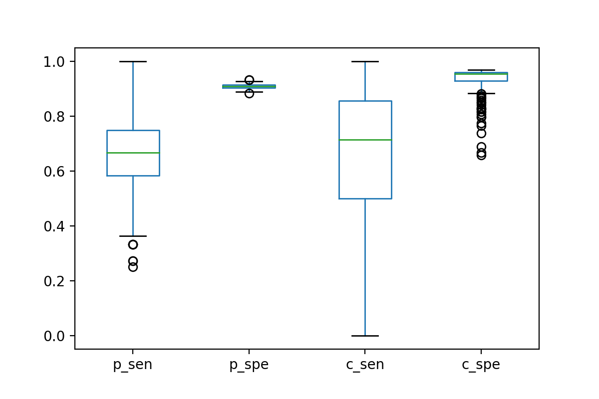

# A Pathogenic Single-nucleotide Variant Prediction Model for Asian Genetic Disease Community

## Introduction
Whole exome sequencing has been used widely in individual patient diagnosis and large-scale research projects since its first clinical diagnosis in 2009. It is a fast, and economical way to find potential pathogenic SNVs in patients' genome compare to Whole Genome Sequencing (WGS), which sequence every single point in patients' genome. The WES only sequences the exon region. In this study, all data are generated using WES.

There are various models out there for SNV pathogenicity prediction/classification, include PolyPhen2, SIFT, M-CAP, SNPs3D, GERP++, REVEL, PhD-SNP, CADD and so on. These models could be classified as 3 types, 

In spite of various models mentioned above, there is no model tranied and verified specifily for East Asian community. With the raw data collected from hospitals from China, we expect to generate a ensembel model that accurately predict pathogenic SNVs. The purpose of this study is to train a model that could predict SNV pathogenicity and generate a score as reference for clinical decision-making. 

## Data 
There are 1402 patients' annotated variants (17,633,323 SNV points in total ) in the database so far, which are used to train and test the model. As time goes by, the model would learn and improve itself as more data kick in.

After annotation, every variant has following variables, details are in Appendix I: 
> "chrom", " S/p/M", "REVEL/M-CAP", "loc", "gene", "REF", "ALT", "HGVS", "Func.ensGene", "ExonicFunc_refGene", "het/hom", "rs ID", "Converge MAF", "Clinvar", "HGMD", "ensemblID", "MAF in ESP6500", "MAF in 1000g", "MAF in ExAC_ALL", "highest_freq", "SIFT score", "Polyphen2 score", "MutationTaster_score", "MutationTaster_pred", "Polyphen2 HDIV_pred", "SIFT pred", "chrom loc", "heterozygosity", "pheno_related rate", "0|1 in Converge", "gAD_E_EAS", "0|0 in Converge", "1|1 in Converge", "ExAC_EAS", "Reference", "gnomAD exome_ALL", "SplicingPre", "disease", "FinalResult", "depth", "system_result" and "user_confirm". 

The data are collected by PuYun Medical Company from hospitals in Wuhan, China. The bioinformatic analysis and annotation were performed by a medical assistant decision-making system, powered by OceanCloud Gene Company. All data are unpublished.  

## Methods
***Data Re-sampling***  
As only about 0.002% SNVs in cleaned dataset are marked as pathogenic/likely pathogenic, it is essential to go through a re-sampling approach (thanks to advice from Dr. Blair). In this dataset, as we focus on pathogenic/likely pathogenic points more than the rest, a re-sampling method would apply. 

***Variable Selection***  
Not all annotations are useful. Non-meaningful variables will be dropped before model training. Categoricial variables were transfered to dummies.

***Machine Learning Model***  
Variant machine learning models are used to find an optimistic one. Models include Regression, SVM, Random Forest, and more. 

***Verification***  
New data will be used to test the performance of existing model. 

## Limitations and Issues
The patients' phenotypes are not evenly distributed. Not all phenotype data was avilable, for existing data there were more epilesy patients than others. [phenotype counts](value_counts.txt) This study combined SNVs from all 1404 patients. It is a question that whether this model has a bias to the majority phenotype SNVs even duplicates were removed.  

So many missing values were in the raw dataset, especially in the columns **"Clinvar"** and **"HGMD"**, which are two databases record SNVs pathogenicity with published evidence. These two features were transfered to dummies.

## Current Progress
### 7/29/2019 update [python script](LR_model_all.py)
A logistic regression model was built using randomly-selected half SNVs to predict pathogenicity risk. The outcome is based on ACMG standard, likely pathogenic/pathogenic are marked as positive, the rest are marked as negative. **A random down-sampling method applied, missing values are filled by feature means.** On test set, overall accuracy is around 74%, overall sensitivity is 84%, overall AUC is 0.80. [scalar](p_or_not_lr_scalar.sav) [model](p_or_not_lr_model.sav)

The features used are: 
> "SIFT", "polyphen2", "REVEL", "M-CAP", "count", "pheno_score", "C_NaN", "C_association", "C_benign", "C_benign/likely_benign", "C_conflicting_interpretations", "C_likely_benign","C_likely_pathogenic","C_not_provided","C_pathogenic", "C_pathogenic/likely_pathogenic", "C_uncertain_significance", "NaN_ExonicFunc", "frameshift deletion", "frameshift insertion", "frameshift substitution", "nonframeshift deletion", "nonframeshift insertion", "nonframeshift substitution", "nonsynonymous SNV", "stopgain","stoploss","synonymous SNV", "unknown", "DFP", "DM", "DM?", "DP", "FP", "NaN_HGMD" and “R”. The features after “pheno_score” are all dummy variables transformed from “Clinvar”, “ExonicFuc_refGene” and “HGMD”. 

Then another logistic regression model was built using the other half SNVs to predict final result (user selection). The outcome is based on previous user’s choice, annotated results/confirmed are marked as positive, the rest are marked as negative.  **A random down-sampling method applied, missing values are filled by feature means.** On test set, overall accuracy is around 79.1%, overall sensitivity is 85.5%, overall AUC is 0.86. [scalar](c_or_not_lr_scalar.sav) [model](c_or_not_lr_model.sav)

This model then used on 423 new data (not the test set), sensitivity and specifity for each models are collected and shown below.  

### Future Work Thoughts
1. Try other mahcine learning models like random forest with no filling missing values.  
2. Try different weights/down-sampling combinations.  
3. More features/annotations should have been added into the analysis if possible.  
4. Final goal is to identify potential pathogenic SNVs that has no annotated before.

## Reference

## Appendix I 
| Feature  | Note | Example (not from a same SNV) |Selected in filtered dataset|
| ---------- | -----------|-----------|-----------|
| chrom   |  chromosome number | chr1|| 
| S/p/M   |  prediction for SIFT, Polyphen2 and M-CAP  |T/B/P| |
| REVEL/M-CAP  | score for REVEL and M-CAP |0.034/-1.0|:heavy_check_mark: |  
| loc  |  location on chromosome  |12921132| |
|  gene |  gene name  | PRAMEF2||
|REF   |  reference single nucletide | A||
| ALT  |  alternative single nucletide  |G| |
|  HGVS |  HGVS annotation for the SNV  |PRAMEF2:NM_023014: exon4:c.923A>G:p.E308G|:heavy_check_mark:|
| Func.ensGene | type of the SNV location |exonic|    |
| ExonicFunc_refGene | mutation type|nonsynonymous SNV|  :heavy_check_mark:  |
| het/hom  |  heterozygous/homozygous  |het||
| rs ID  |  reference SNP ID number |rs9730080||
| Converge MAF  ||  0.200846  ||
| Clinvar  | Clinvar classification  |pathogenic:1 |:heavy_check_mark:|
| HGMD  | HGMD classification  | DM|:heavy_check_mark:|
| ensemblID  | Ensembl Genomes ID |  ENSG00000219481 ||
| MAF in ESP6500 | frequency in ESP-6500 variants|0.0028	 |   |
| MAF in 1000g  | frequency in 1000 Genomes project|  0.04556 ||
| MAF in ExAC_ALL  |frequency in the Exome Aggregation Consortium| 0.0198 |  |
| highest_freq  |  highest freq among above three variables | 0.04556||
|SIFT score | SIFT prediction score|0.014|:heavy_check_mark:|
| Polyphen2 score  |  Polyphen2 prediction score  |0.448	|:heavy_check_mark:|
|  MutationTaster_score |  MutationTaster prediction score  |1||
|  MutationTaster_pred | MutationTaster classification   |P	||
|  Polyphen2 HDIV_pred |  Polyphen2 classification  |B||
| SIFT pred  | SIFT classification   |D||
| chrom loc  | chromosome # + location  | chrX:50350408	|:heavy_check_mark:|
|  heterozygosity |heterozygosity |  0.382716  ||
|  pheno_related rate | how much this SNV related to phenotype | 1.94 |:heavy_check_mark:|
| 0/1 in Converge  |  population annotation   |359	||
| gAD_E_EAS  |  population annotation    |0.1205||
|  0/0 in Converge | population annotation  |  30	 ||
| 1/1 in Converge  |  population annotation  | 10251	 ||
| ExAC_EAS  |   population annotation   |0.0012	||
|  Reference |   PubMed ID |2495303||
| gnomAD exome_ALL  |population annotation  |  0.016	  ||
|  SplicingPre |  splicing prediction|  no |:heavy_check_mark:|
| disease  | related disease   |SIMPSON-GOLABI-BEHMEL综合征1型；SGBS1 肾母细胞瘤1；WT1||
|  FinalResult | union set of system result and user confirm |Uncertain significance |:heavy_check_mark:|
| depth  | sequencing depth   |122||
| system_result  |suggestion based on ACMG standard|  Pathogenic  |:heavy_check_mark:|
| user_confirm  |describe if user select this SNV for final result or not, selected = 1, marked = 2, not selected = 0 |  1 |:heavy_check_mark:|
